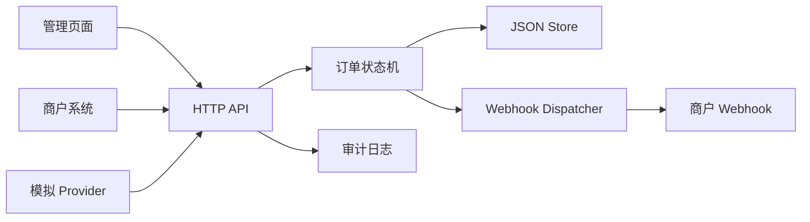

# 架构说明

## 模块



## 状态机

```text
CREATED -> PENDING_PAYMENT -> PAID_MANUAL_CONFIRMED -> WEBHOOK_DELIVERED
CREATED -> PENDING_PAYMENT -> CANCELLED
CREATED -> PENDING_PAYMENT -> EXPIRED
PAID_MANUAL_CONFIRMED -> WEBHOOK_FAILED
WEBHOOK_FAILED -> WEBHOOK_DELIVERED
```

## 数据模型

- `orders`：订单金额、主题、状态、provider、webhookUrl、时间戳和 metadata。
- `paymentEvents`：人工确认、模拟通知、取消、过期等事件。
- `webhookDeliveries`：投递目标、签名、幂等键、响应码、错误信息和尝试次数。
- `auditLogs`：操作人、动作、资源、前后状态、IP、User-Agent。

## 安全策略

- 商户下单和查询使用 `MERCHANT_TOKEN`。
- 管理操作使用 `ADMIN_TOKEN`。
- 模拟 provider 使用 `SIMULATE_PROVIDER_TOKEN`。
- Webhook 使用 HMAC-SHA256 签名。
- 默认阻止内网、localhost 和链路本地 webhook 地址，除非显式设置 `ALLOW_PRIVATE_WEBHOOKS=true`。
- 审计日志记录所有状态变更。
